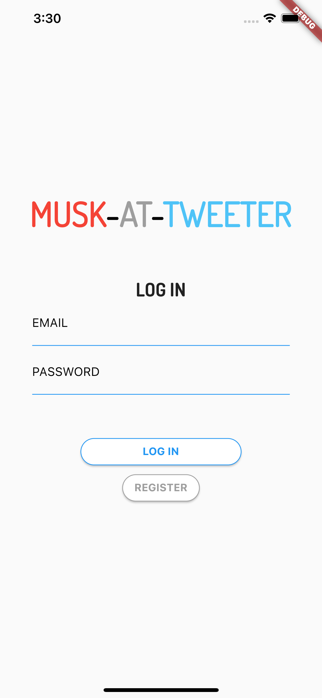
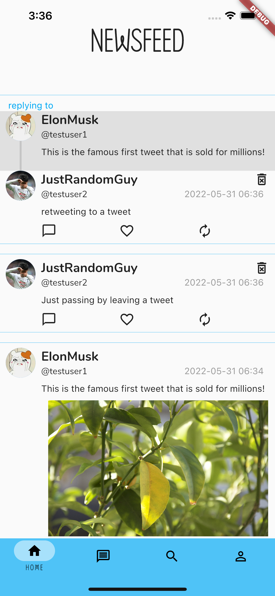
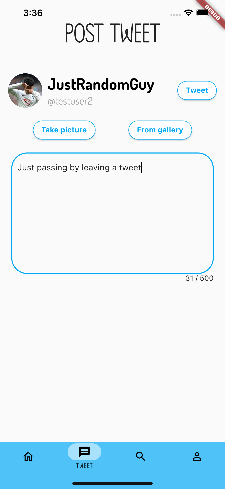
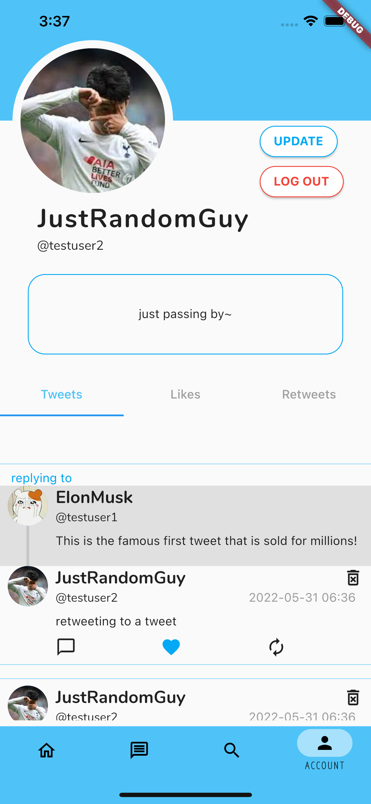
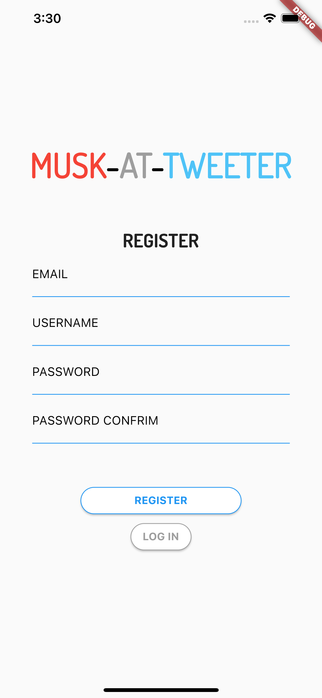
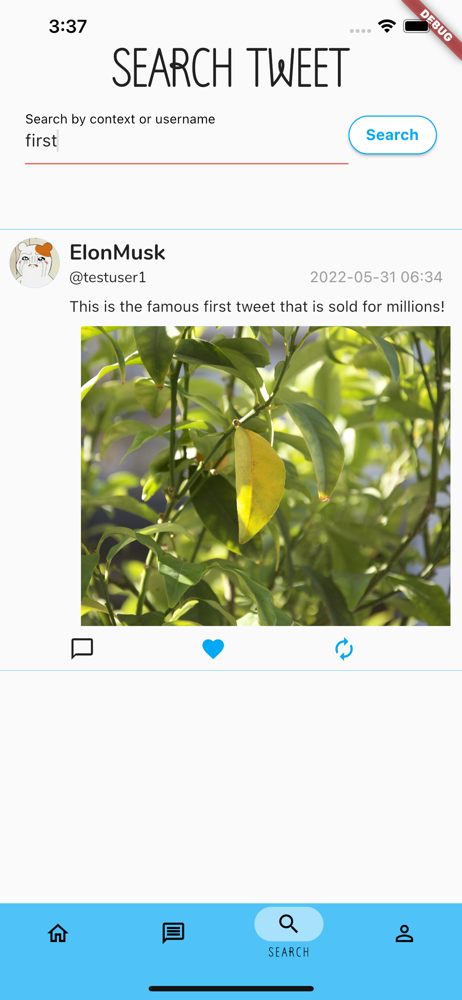

# MUSK-AT-TWEETER : Twitter Clone

## Objectives
to create fullstack application using Flutter as frontend and Django Rest Framework as backend

### Functionalities Implemented

|Account related|Tweet related|Views|
|-|-|-|
|sign up|post|Newsfeed: display all tweets|
|log in|delete|Post: create & post new tweet|
|change password|like|Search: search tweet by body or username|
|change nickname|reply|Profile: can see other user's profile page|
|change welcome message|retweet|Account: current user's profile page with access to account management tools|
|change profile picture|
|delete account|

**
  
  
  

**
  
  
  

